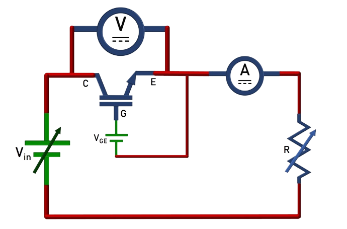
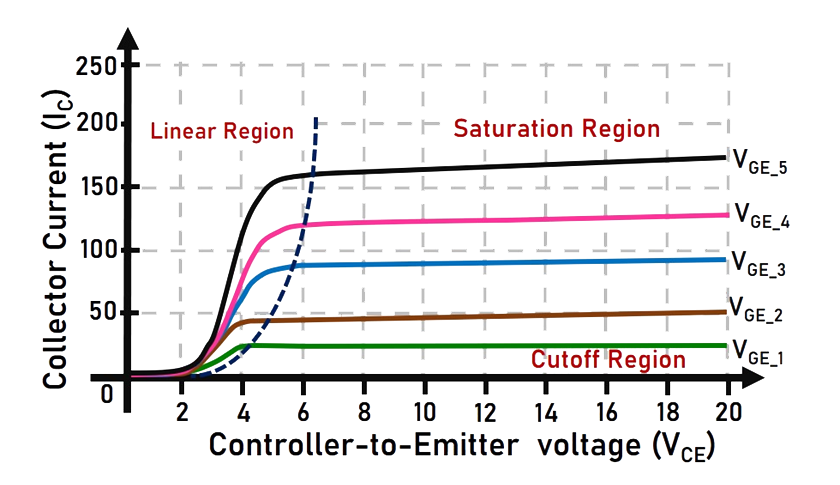
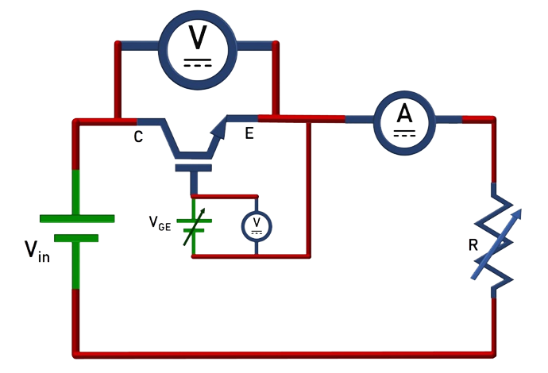
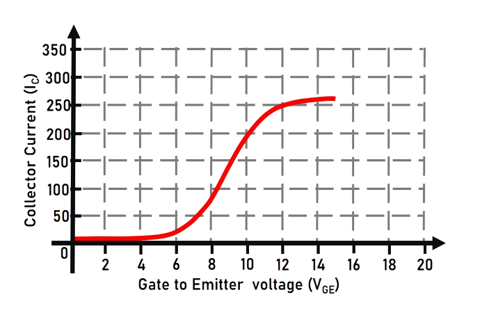

### Theory

**Representation of IGBT:**

Fig. 1(a) and 1(b) show the symbolic representation of IGBT and a typical IGBT package available in market.

 

<table border="0" align="center" style="width:100%; border:none;">
  <tr>
<td style="width:50%">

 

  
Fig. 1(a). Symbolic representation of IGBT.
  

</td>
<td style="width:50%">
  

 

  
Fig. 1(b). A typical IGBT package.
  

 
    </td>
  </tr>
</table>
 

 

 
  
**Introduction to IGBT:**

Fig. 2 shows the internal structure of an IGBT. Some of the key features of IGBT are compiled and given below.

 
Fig. 2. Internal structure of IGBT.
 

 

1.  Insulated-Gate Bipolar Transistor (IGBT) is a semiconductor power device. It combines the advantages of a BJT and a MOSFET. It has high input impedance, like MOSFET, and low on-state conduction losses, like BJT. However, it shows higher switching time especially during the turn-off transition. 

2.  It has a four PNPN layer structure: a) Two P-type doped (p) layers. b) Two N-type doped layers- one is heavy doped (n+) and the other is lightly doped (n-). It has three junctions: n+-p (J1), p-n- (J2) and n--p (J3). 
3.  The  SCR has three external terminals namely: Anode (A), Cathode (K) and Gate (G).  

**Operating modes of IGBT:**
 

1.  Forward Blocking State: An IGBT is a voltage controlled device. When the Collector voltage is made more positive with respect to the Emitter and the Gate current is zero, the Collector current is negligible.

2.  Forward Conducting State: When the Gate voltage is made more positive than the Emitter voltage, n carriers are drawn into the p-channel near the gate region; this results in a forward bias of the n-p and p-n junctions. Current freely flows from collector to emitter. 
During forward conduction, the IGBT will operate in any one of the following states, depending on the values of Collector-to-Emitter voltage (VCE) and the Gate voltage (VGE) values: Cut-off region, Active region or Saturation region.
  
3.  Once the SCR starts conducting, gate loses control over the device. It continues conducting even after gate signal is removed. However, if the forward anode current (IA) is reduced below a level known as the ‘holding current’ (IH), the SCR goes to blocking state. The holding current is less than the latching current.

4.  Reverse Blocking State:  When the Emitter voltage is higher with respect to the Collector voltage, no current can flow through the device even with gate current applied.  

**Characteristics of the IGBT:**

There are two important characteristics defined for an IGBT:

1.  Output Characteristics: It is the plot between the Collector-to-Emitter voltage (VCE) and the Collector current (IC) for a fixed Gate-to-Emitter voltage (VGE). The circuit diagram to plot the characteristics is given in Fig. 3. Voltage ‘VCE’ is measured by the voltmeter while the ammeter measures the current ‘IC’.  

 
Fig. 3. Circuit diagram for Output characteristics.
 

  

The output characteristics of IGBT is shown in Fig. 4.

 
Fig. 4. Output characteristics of IGBT.
 

  
IGBT has three operating regions: Cutoff region, Linear region and Saturation region as shown in Fig. 4.   

a)  In cutoff region, the Gate voltage is lower than the threshold (VT) and the IGBT doesn’t conduct. 
b)  In linear region, the Collector current IC varies in proportion to the Collector-to-Emitter voltage VCE. IGBT is operated in the linear region for switching actions. 
c)  In the saturation region, the Collector current remains almost constant for any increase in the value of VCE. 

 
  
2.  Transfer Characteristics: It is the plot between the Gate-to-Emitter voltage (VGE) and the Collector current (IC) for a fixed value of Collector-to-Emitter voltage (VCE). The circuit diagram to plot the characteristics is given in Fig. 5. Voltage ‘VGE‘ is measured by the voltmeter while the ammeter measures the current ‘IC’.

 
Fig. 5. Circuit diagram for Transfer characteristics.
 

 

 
  
The Transfer characteristics of IGBT is shown in Fig. 6. 

 
Fig. 6. Transfer characteristics of IGBT.
 

